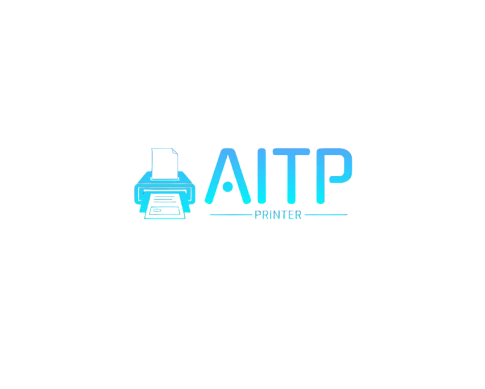

# **Smart Printer**  

  

---

## **Overview**  
**Smart Printer** is a self-service printing system that operates 24/7 within the university. Students can upload their files via the website, pay electronically, and collect their prints easily and securely without human intervention.  

---

## **Features**  
- **Upload files via the website** – Supports multiple formats such as PDF, DOCX  
- **Integrated electronic payment system** – Prepaid balance and direct payment options  
- **Print customization** – Select number of copies, paper size, and print type  
- **Print management and tracking** – Real-time notifications on print status  
- **QR Code scanning for pickup** – Secure and easy retrieval  
- **Fully automated operation** – Reduces the need for staff and minimizes wait times  
- **Responsive design** – Works on all devices (PC, mobile, tablet)  

---

## **Technologies Used**  
- **Front-End:** HTML, CSS, JavaScript, Bootstrap  
- **Back-End:** PHP   
- **Database:** MySQL  
- **Printing System:** CUPS (Common UNIX Printing System)  
- **Communication:** RESTful API, WebSocket  
- **Hardware:** Raspberry Pi 5, printer 

---

<h5 align="center">Developed by</h5>

  

<h3 align="center">AITP Team</h3>
